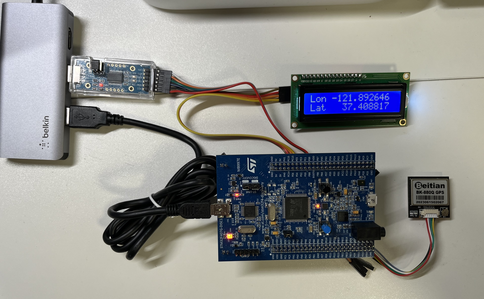
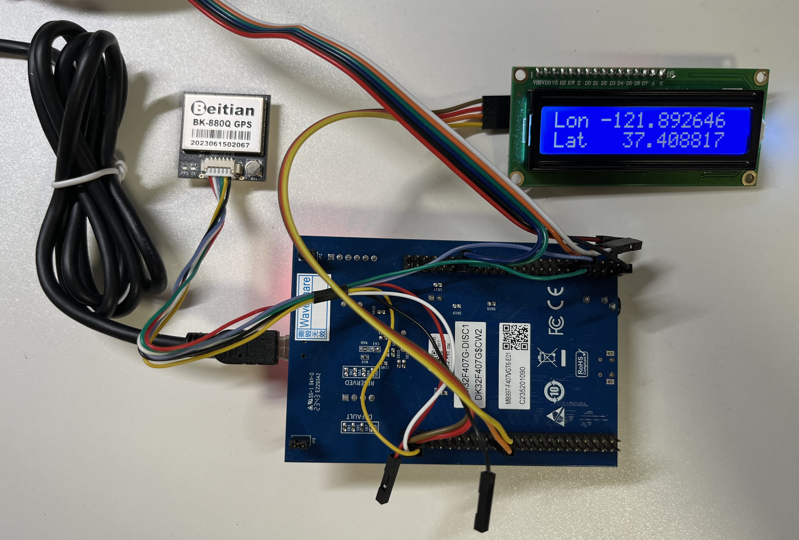

# RTOS-GPS-tracker
A FreeRTOS-based GPS tracking project demonstrating task management, UART communication, and real-time data processing.
This project is designed for the STM32F4-Discovery board and utilizes FreeRTOS to receive NMEA information from a GPS module via UART. The processed latitude and longitude information is then displayed on an LCD screen.

## Table of Contents
* Overview
* Features
* Hardware Requirements
* Software Requirements
* Project Structure
* Getting Started
* Usage
* License

## Overview
This project is designed for the STM32F4-Discovery board and utilizes FreeRTOS to receive NMEA information from a GPS module via UART. The processed latitude and longitude information is then displayed on an LCD screen.

## Features
* Receive GPS data via UART
* Process NMEA sentences to extract latitude and longitude and other optional messages.
* Display the GPS data on a 16x2 LCD screen.
* Use FreeRTOS for real-time task management.

## Hardware Requirements
* STM32F4-Discovery board
* GPS module
* 16x2 LCD screen with I2C interface
* USB to TTL serial converter adapter
* Connecting wires

## Software Requirements
* STM32CubeIDE
* FreeRTOS(FreeRTOS Kernel V10.4.3)
* SEGGER SystemView

## Getting Started
### Hardware Setup

* Connect the GPS module to the UART3 interface of the STM32F4-Discovery board.

  | GPS module pins | STM32F4 Disc pins |
  | :-----------: | :-----------:|
  | VCC | 5V  |
  | RX  | PD8 |
  | TX  | PD9 |
  | GND | GND |
  
* Connect the 16x2 LCD screen module to the I2C1 interface of the STM32F4-Discovery board.
  
  | LCD module pins | STM32F4 Disc pins |
  | :-----------: | :-----------:|
  | GND | GND |
  | VCC | 5V |
  | SDA | PB7 |
  | SCL | PB6 |
  
* Connect the converter adapter to the STM32F4-Discovery board.
  
  | Converter adapter pins | STM32F4 Disc pins |
  | :-----------: | :-----------:|
  | TX  | PA3 |
  | RX  | PA2 |
  | GND | GND |
  
* Connect the STM32F4-Discovery board to PC.

### Software Setup
* Clone this repository:
* Open the project in STM32CubeIDE.
* Build the project.
* Flash the firmware to the STM32F4-Discovery board.

## Usage
* After flashing the firmware, the STM32F4-Discovery board will start receiving GPS data via UART.
* The processed latitude and longitude information will be displayed on the 16x2 LCD screen.
* Use SEGGER SystemView to monitor and debug the FreeRTOS tasks.

## License
This project is licensed under the MIT License. See the [LICENSE](./LICENSE) file for details.

___
Feel free to contribute to this project by submitting issues or pull requests. 
For any questions, please contact me.
